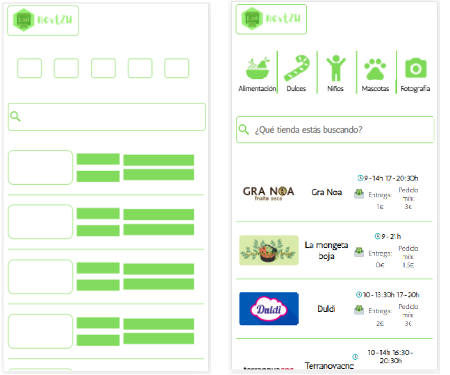

# next2U
## The app that connects you with your local stores

------

### General description
**next2U** is an app to buy things from small stores by filtering by location and by kind of store.

*Necessity that resolves*:
Big companies such as Fnac, elCorteIngles, the big supermarkets and similar have their own on-line platform and delivery system. But small local stores don’t have enough resources (neither technological nor logistics) to achieve that goal.
Being inspired by other platforms (like ones which join different restaurants), **next2U** seeks to become a platform where little stores could easily sell online and deliver their products to their customers (if they want it).

#### Check the website
<https://next2u-31408.web.app/last_confirmation>

***Because of technical "problems api calls the project just works near the addresses:
- Rambla Poblenou, 50. Barcelona
- Av. Parc, 57. Cornellà de Llobregat

------

### Components
#### Header
- Input to search by adress
- Button to search by the inpu value

You will change to the next page when the input button is clicked


#### Stores result
- Filter list by kind of store
- Input to search by name
- Stores that match with the filters list (printed with cards). Each card will show:
  - photo
  - name
  - kind of store
  - Minimum price order
  - Delivery time
  - Opening hours

You will change to the next page selecting a store card.



#### Store detail
- Store detail card
- Products list (ordered by product categories) printed with cards. Each card will show:
  - photo
  - name
  - price/unit
  - input to select quantity
- Filter by product categories (to navigate to the page part where the category starts)
- Order detail. It will show:
  - Product detail:
    - Name
    - Units selected
    - Price
  - Button to delete the product
  - Final price
  - Button to confirm order

You will change to the next page when confirm order button is clicked


#### Confirm order
- Order detail. It will show:
  - Product detail:
    - Name
    - Units selected
    - Price
  - Button to delete the product
  - Final price
- Delivery adress
- Contact info
- Button to confirm the order --> appears a pop up with the resume --> ***THE APP FINISHES HERE***


------
### Data model Firebase
```js
#### USERS:
  {
    ID: uid,
    name: String,
    surnames: String,
    adress(es)_to_deliverr: String,
    mail: String,
    phone: Number,
    last_order_ID: uid
  }

#### STORES_LIST
  {
    ID: uid,
    name: String,
    location: String,
    photo: String,
    deliver_option: boolean,
    deliver_price: Number,
    score: number,
    opening_hours: array,
    minimum_price_order: Number,
    store_categories_id (“labels”): Array of strings,
    product_list: {
      product_category_ID: Number: product_ID: Array of numbers
      ("as much entries as product_categories_ID has the store linked")
    }
    img: URL
  }

#### STORE_CATEGORIES
  {
    ID: uid,
    name: String,
    img: String
  }

#### PRODUCT_CATEGORIES
  {
    ID: uid,
    name: String
  }


#### PRODUCTS_LIST 
  {
    ID: uid,
    name: String,
    product_category id: Number,
    price/unit: Number,
    kind_of_unit: String,
    units_available: Number,
    photo: String,
    description: String
  }


#### ORDERS
  {
    ID: uid,
    user_ID: uid,
    store_ID: uid,
    product details: {
        name: String,
        units: Number,
        price: Number
    }
  total_price: Number,
  date: Date???,
  status: Enum (delivered/picked/cancelled)
}
```

### Technologies used


### Tests
*[Here are the results](https://gph.is/g/ZlQL2AK)*

### Flow Chart


